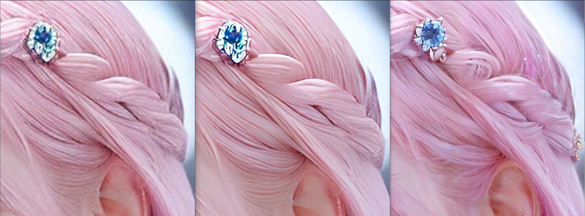
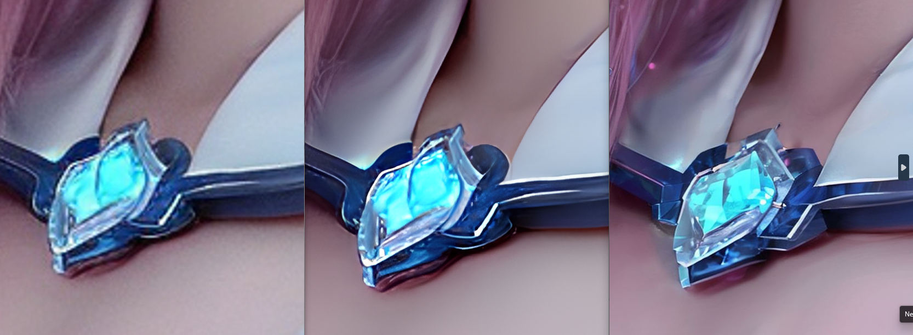

# ControlNet for Stable Diffusion 

ControlNet enables you to precisely control your AI image generations, serving as the gateway that connects the stable diffusion models to real-world productivity.

## ControlNet Workflow

Annotator >> ControlNet >> Diffusion

- Annotator - extracts information from images for use by ControlNet
- ControlNet - uses this information to guide the diffusion process
- Diffusion - generates images as directed by ControlNet


*OpenPose for demostration

## ControlNet Installation

Installation Guide is based on AUTOMATIC1111/stable-diffusion-webui

1. Open WebUI: http://127.0.0.1:7860/
2. Navigate to: Extensions -> Install from URL
3. ControlNet Git: https://github.com/Mikubill/sd-webui-controlnet
4. Navigate to: Installed ->  Apply and restart UI
5. Download Models: https://huggingface.co/lllyasviel/ControlNet-v1-1

## ControlNet Settings

- Enable - enable ControlNet
- Pixel Perfect - use the image height and width you specified in text-to-image to generate the preprocessed control map
- Allow Preview - use the explosion icon see the preprocessed control map
- Low VRAM - For poor GPU with less than 8GB VRAM
- Preprocessor - AKA Annotator, preprocessing the input image to control map
- Model - ControlNet model to use, detal refers to section "ControlNet Models"
- Control Weight - controls how much the control map is followed relative to the prompt
- Starting ControlNet step - ControlNet first applies, 0 means the very first step.
- Ending ControlNet step - ControlNet ends. 1 means the last step.
- Control Mode - The ControlNet is applied to conditioning or unconditoning or both in a sampling step

## ControlNet Models

- Canny
    - Old-school edge detector, extracts the outlines of an image
    - Ideal for general purposes
- MLSD
    - M-LSD straight line detection
    - Ideal for buildings and rooms
- SoftEdge
    - Soft HED Boundary, will preserve many details in input images, making this suitable for recoloring and stylizing. 
    - Ideal for paints, 3D arts
- Scribble
    - Draw scribbles with your favorite drawing software, for example, MS Paint
    - Ideal for sketches
- OpenPose
    - Detects human key points such as positions of the head, shoulders, hands, etc. 
    - Ideal for human
- Tile resample
    - Enhancing images with additional details
    - Ideal for upscaling
- Reference
    - Generate images similar to the reference image
    - Ideal for reproducing variations
- IP Adapter
    - Image Prompt Adapter allows you to use an image as a prompt
    - Ideal for reproducing variations
- Depth
    - Guesses the depth information from the reference image 
    - Ideal for images/photos with great depth of field

## Use Case 1 - Precise Pose Control 

Utilize [img2img] for generating images that maintain a consistent pose and composition.
```
Positive prompt: 1girl, black eyes, blurry background, blurry foreground, depth of field, earrings, hairclip, jewelry, lips, long hair, pink hair, realistic, solo, <lora:JapaneseDollLikeness_v15:1>
Negative prompt: disfigured, ugly, bad, immature
Steps: 35, Sampler: DPM++ 2M Karras, CFG scale: 7, Seed: 4219467701, Size: 1024x683, Model hash: 59ffe2243a, Model: Chilloutmix-Ni-pruned-fp16-fix, Denoising strength: 0.75, ControlNet 0: "Module: dw_openpose_full, Model: control_v11p_sd15_openpose [cab727d4], Weight: 1, Resize Mode: Crop and Resize, Low Vram: False, Processor Res: 512, Guidance Start: 0, Guidance End: 1, Pixel Perfect: True, Control Mode: Balanced, Save Detected Map: True", Lora hashes: "JapaneseDollLikeness_v15: 50b3f6a2ecf7", Version: v1.6.1
```


## Use Case 2 - Upscale with detail

Stable Diffusion checkpoint: dreamshaper_8.safetensors [879db523c3]

img2img
- Sampling steps: 50
- CFG Scale: 7 (6 ~ 8)
- Denoising strength: 0.3 (0.2 ~ 0.5)

ControlNet
- Control Type: Tile/Blur
- Preprocessor: tile_resample
- Model: control_v11f1e_sd15_tile
- Control Mode: ControlNet is more important

Script
- Script: Ultimate SD Upscale
- Target size type: Scale from image size
- Scale: 4
- Upscaler: 4xUltrasharp
- Tile width: 512

Comparisons: [Original] VS [R-ESRGAN] VS [ControlNet]



