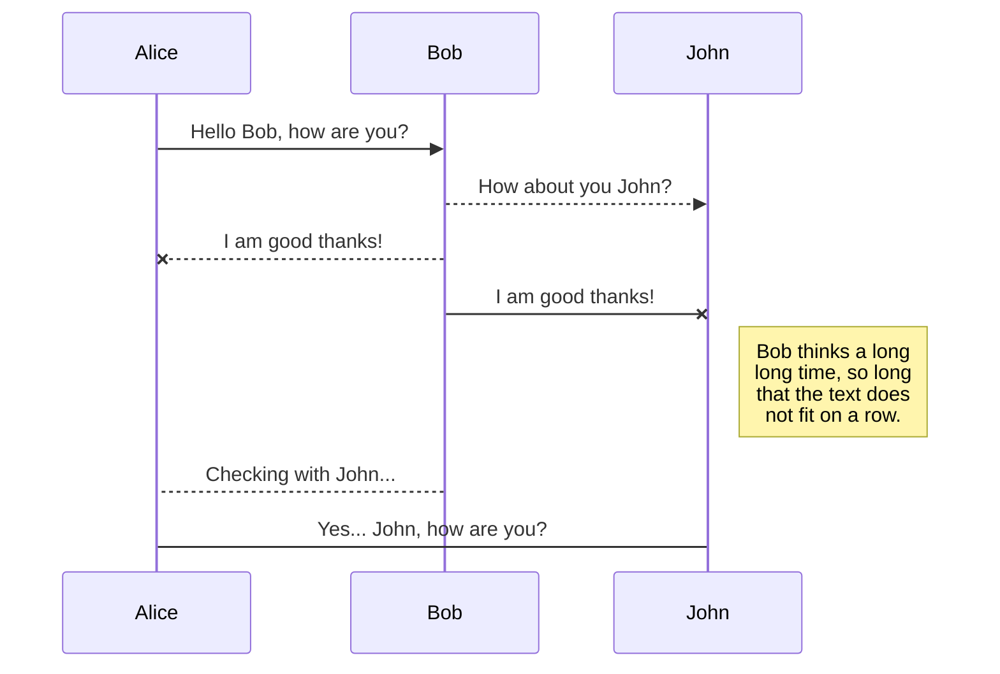
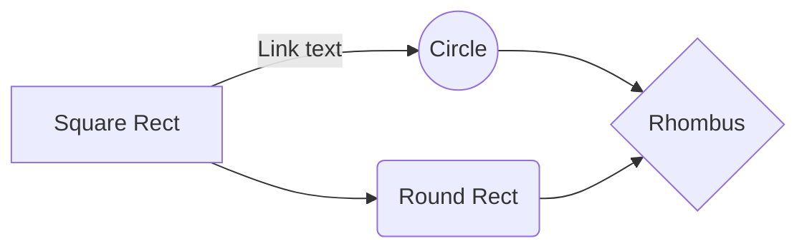

# HEADING
```
# H1 HEADING
## H2 HEADING
### H3 HEADING
#### H4 HEADING
##### H5 HEADING
###### H6 HEADING
```
# H1 HEADING
## H2 HEADING
### H3 HEADING
#### H4 HEADING
##### H5 HEADING
###### H6 HEADING

---
# STYLE
```
**bold text**  __bold text__

*italic text* _italic text_

***bold and italic text***

~~strikethrough text~~ 	
```
**bold text**  __bold text__

*italic text* _italic text_

***bold and italic text***

~~strikethrough text~~ 	

```
To create a line break or new line,  
end a line with two or more spaces.
<br> br tag works the same.
```
To create a line break or new line,  
end a line with two or more spaces.
<br> br tag works the same.

```
> ## Blockquote title
> 
> blockquote text line 1
>  
> blockquote text line 2
>> 
>> nested blockquote text
```
> ## Blockquote title
> 
> blockquote text line 1
>  
> blockquote text line 2
>> 
>> nested blockquote text

```
Ordered List
1. First item
2. Second item
3. Third item

Unordered List
- First item
- Second item
- Third item

Mixed List
1. First item
2. Second item
3. Third item
    - Indented item
    - Indented item
4. Fourth item
```
Ordered List
1. First item
2. Second item
3. Third item

Unordered List
- First item
- Second item
- Third item

Mixed List
1. First item
2. Second item
3. Third item
    - Indented item
    - Indented item
4. Fourth item

```
Horizontal Line  
---
```
Horizontal Line  

---

# LINK
```
EMAIL - <fake@example.com>

URL - <https://www.example.com>

HYPERLINK - [EXAMPLE.COM](https://www.example.com)

FILE LINK - [README.md](README.md)
```
EMAIL - <fake@example.com>

URL - <https://www.example.com>

HYPERLINK - [EXAMPLE.COM](https://www.example.com)

FILE LINK - [README.md](README.md)

# CODE BLOCK

~~~
BASIC
```
{
  "firstName": "John",
  "lastName": "Smith",
  "age": 25
}
```

HIGHLIGHT
```json
{
  "firstName": "John",
  "lastName": "Smith",
  "age": 25
}
```
~~~

BASIC
```
{
  "firstName": "John",
  "lastName": "Smith",
  "age": 25
}
```

HIGHLIGHT
```json
{
  "firstName": "John",
  "lastName": "Smith",
  "age": 25
}
```


# TABLE

```
BASIC
| Syntax      | Description |
| --- | --- |
| Header      | Title       |
| Paragraph   | Text        |

ALIGNMENT
| Syntax      | Description | Test Text     |
| :--- | :---: | ---: |
| Header      | Title       | Here's this   |
| Paragraph   | Text        | And more      |
```
BASIC
| Syntax      | Description |
| --- | --- |
| Header      | Title       |
| Paragraph   | Text        |

ALIGNMENT
| Syntax      | Description | Test Text     |
| :---        |    :----:   |          ---: |
| Header      | Title       | Here's this   |
| Paragraph   | Text        | And more      |


# FORMULA

You can render LaTeX mathematical expressions using [KaTeX](https://khan.github.io/KaTeX/):

The *Gamma function* satisfying $\Gamma(n) = (n-1)!\quad\forall n\in\mathbb N$ is via the Euler integral
```
$$f(x) = ax^2 + bx +c$$ 

$$\Gamma(z) = \int_0^\infty t^{z-1}e^{-t}dt\,.$$

$$\sum_{i=0}^n i^2 = \frac{(n^2+n)(2n+1)}{6}$$

$$SD_i = \frac{exp(-0.05*S_i)-exp(-0.05*E_i)}{0.05}$$
```
$$f(x) = ax^2 + bx +c $$ 

$$\Gamma(z) = \int_0^\infty t^{z-1}e^{-t}dt\,.$$

$$\sum_{i=0}^n i^2 = \frac{(n^2+n)(2n+1)}{6}$$

$$SD_i = \frac{exp(-0.05*S_i)-exp(-0.05*E_i)}{0.05}$$

> You can find more information about **LaTeX** mathematical expressions [here](http://meta.math.stackexchange.com/questions/5020/mathjax-basic-tutorial-and-quick-reference).


# UML CHART

You can render UML diagrams using [Mermaid](https://mermaidjs.github.io/). For example, this will produce a sequence diagram:

~~~


And this will produce a flow chart:


~~~


And this will produce a flow chart:

