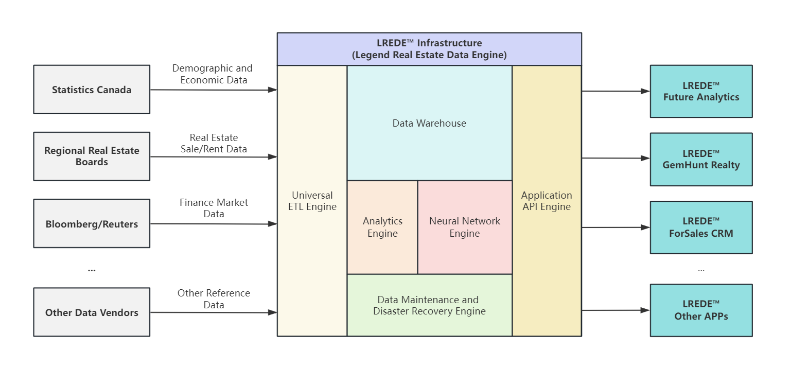

# LREDE™ by Nexus AI - Business Plan
LREDE™ comprises a series of engines and products designed to empower the real estate industry with advanced data and AI technology.

## Abstact Archtecture

## LREDE™ Infrastructure

The LREDE™ infrastructure comprises six major engines/components, each serving a different functionality:

- Universal ETL Engine
    - Universal ETL acts as a gateway to various data vendors, synchronizing data in real-time. This includes, but is not limited to, demographic and economic data from Statistics Canada, real estate market data from various Regional Real Estate Boards, and financial data from Bloomberg and Reuters.

- Data Warehouse
    - Considering its specific nature and use cases, this read-intensive data warehouse employs a traditional relational database in a master-slave architecture, complemented by a memory database for caching. The master-slave architecture enhances availability and read capabilities, while the memory database increases throughput and speeds up access to frequently accessed ('hot') data.

- Analytics Engine
    - Analytics Engine extracts raw data from the data warehouse and generates various kinds of intuitive analysis reports using traditional statistical approaches. Designed with extensibility in mind, new reports can be implemented relatively quickly and efficiently.

- Neural Network Engine
    - The Neural Network Engine leverages deep learning models trained with an extensive amount of historical data from the data warehouse and facilitates advanced data analysis using cutting-edge AI approaches for functionalities like future prediction and value assessment. The forecasting models, designed for trend prediction, are built on hybrid-tuned Multivariate Recurrent Neural Networks. The appraisal models, designed for value assessment, are built on hybrid-tuned Multilayer Perceptrons.

- Data Maintenance Engine
    - The Maintenance Engine archives deprecated data to improve efficiency, resyncs corrupted data through ETL jobs, constructs memory caches for both frequently accessed ('hot') data and complex report ainquiries, and performs data backups to both local and remote locations for disaster recovery.

- Application API Engine
    - The Application API Engine, a RESTful API framework, is designed to allow applications to access LREDE™'s internal components, including the Data Warehouse, Analytics, and Neural Network Engines. This facilitates the development of a wide range of applications, each with its own unique and complex business logic, leveraging a robust infrastructure of data, analytics, and AI.

## LREDE™ Applications

LREDE™ applications, built on the LREDE™ infrastructure, offer a diverse set of features to meet the needs of different groups of people.

### Future Analytics™

- Description
    - Future Analytics provides comprehensive data for analyzing the real estate market, enabling you to study past patterns, understand current dynamics, and predict future trends. The data, presented in a visually intuitive format, include not only direct real estate market information (such as transactions and supply and demand metrics), but also indirect factors that influence the market (such as mortgage and exchange rates, construction material indices, and economic indicators). 

- Highlight Feature
    - AI Trend Prediction: Powered by the LREDE™ Neural Network Engine, this feature utilizes RNN models to predict future trends in real estate market metrics. The design benchmarks, established using 10 years of historical data, are detailed as follows:
      | Forecast Period | Accuracy |
      | --- | --- |
      | 1-Month | 90% + |
      | 2-Month | 75% + |
      | 3-Month | 60% + |
    
    - AI Appraisal Report: Powered by the LREDE™ Neural Network Engine, this feature utilizes MLP models to estimate property value and generate appraisal reports. The design benchmark, based on tests using recent 1 year of transactions, is ± 10% accuracy.

- Target Customer
    - Professionals and agencies involved in real estate investment, such as developers, land bankers, realtors, market researchers, and high-net-worth individuals.

- Business Model
    - Subscription Fee:  Each user will purchase their account for a fixed monthly fee. 
    - Enterprise Customization: Customized reports and neural network models based on specific requirements.

- User Scenarios
    
    The real estate retail market can experience considerable fluctuations, with the average or median price of a single house varying by up to 15% or $200,000 in just one month. Consequently, optimal timing can lead to substantial wealth gains or savings.

    - Developer: Select the best timeframe for pre-sale, land acquisition, and liquidation activities.
    
    - Agency: Offer professional advice to clients, backed by solid data and AI analysis.

    - Individual: Determine the most favorable period to buy or sell properties.

### GemHunt Realty™

- Description
    - The next-generation property search site, powered by AI, enables consumers to find properties listed below their actual value, a feature we call "Gem Hunt".

- Highlight Feature

    - Gem Rating: This feature leverages MLP models to appraise the value of all active listings on the market. It compares the listing price with the AI-appraised property value, identifying the discrepancy between the two, which is termed the Gem Rating. Consumers can search and filter properties based on the Gem Rating, enabling them to find the best deals in their designated area.

    - Tender Marker: This feature identifies properties listed for sale by tender, meaning they are listed without a set price or at a price significantly below market value, thereby inviting buyers to submit their bids (tenders). Tender Marker tags properties declared for sale by tender and also flags listing brokers who have frequently employed this strategy in the past, as determined by algorithms. These listings can be filtered using the Gem Hunt Search.
    
- Target Customer
    - Consumer User: Home Buyer and Sellers
    - Business User: Real Estate Agency
    
- Business Model
    - Consumer User: Free to use
    - Business User
        - Lead Generation, advertising space bidding
        - Lead Referral, pre-qualified lead refering