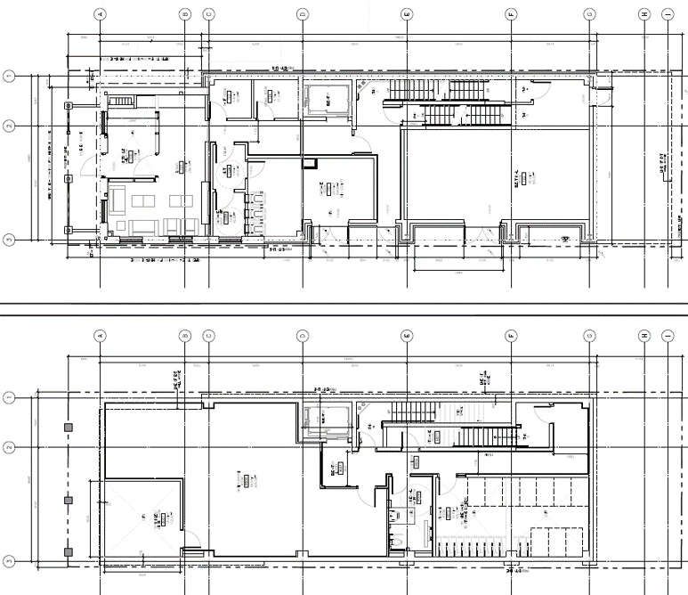
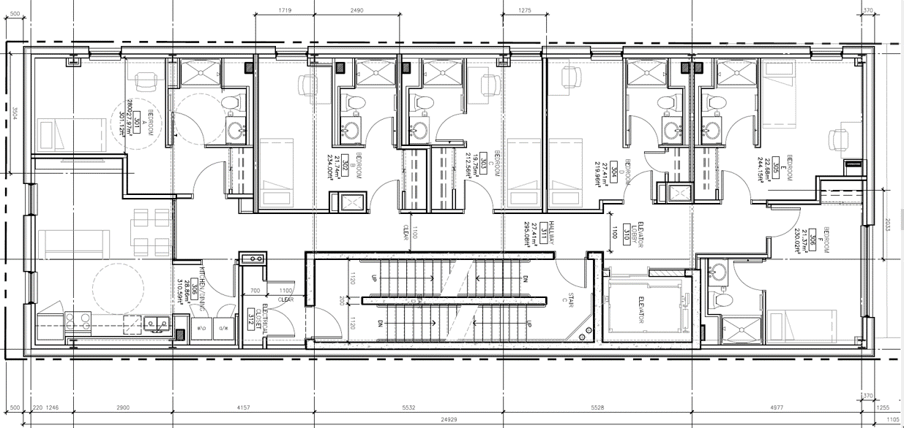

# 15 Glen Morris Cooperation Plan

## Cooperation Option 1 - Full Floor Lease

The CoStone property management provides clients with the option to lease entire floors, which come with furnished interiors and exclusive elevator access. Clients have the autonomy to manage operations, including activities such as subleasing, catering, etc. This business model can be extended to other CoStone properties based on mutual satisfaction.

- Building Address: 15 Glen Morris
- Available Space: Up to 4 floors, with 24 bedrooms in total
- Square Footage: Approximately 2,400 sqft per floor
- Rent: $13,200 per month for each floor
    - Equivalent to $2,200 per room or $5.50 per square foot
- Furniture: Included in the lease
- Utilities: Additional, with costs shared based on the GFA
- Amenities: Access to shared amenities on the 1st floor and basement

## 合作方案1 - 整层租赁

CoStone物业管理为客户提供整层租赁的选择，包括配套家具的内饰和专用电梯通行权限。客户可以自主管理运营，包括分租、餐饮服务等活动。这种商业合作模式可在双方满意的前提下推广到其他CoStone物业。

- 地址：15 Glen Morris
- 空间：至多4层，共24个卧室
- 面积：每层约2400平方英尺
- 租金：每层每月$13,200加元
    - 相当于每个房间2,200加元或每平方英尺5.50加元
- 家具：租赁包含装修与家具
- 水电：额外收费，费用根据建筑面积（GFA）分摊
- 设施：可使用一楼和地下室的共享设施

## Cooperation Option 2 - Joint Property Management Company

The two parties will establish a property management company together. CoStone will be responsible for fully financing the company's operations and handling all aspects of property acquisition, development, construction, and management. Qiao will hold a 15% equity stake and will be in charge of marketing, leasing, and student services.

参考翻译: 合作计划2 - 成立物业管理公司。

Responsibilities of CoStone
- Funding: Fully finance the company's operations.
- Real Estate: Handle the acquisition, development, construction, and management of properties.

Responsibilities of Qiao
- Property Marketing: Lease units at the most competitive prices.
- Customer Relations: Foster healthy relationships and resolve conflicts involving students, parents, custodians, and schools.
- Student Services: Provide homestay services, such as custodianship and catering, among others.
- Compliance: Ensure that homestay services operate in full compliance with all applicable regulations.

## 合作方案2 - 成立物业管理公司

双方联合创立一家物业管理公司。CoStone将承担公司运营的全部资金支持，主要负责土地物业的收购、开发、建筑以及管理。Qiao将获得公司15%的干股股份，主要负责市场推广、租赁及学生服务。

CoStone责任范围：
- 资金支持：提供公司经营所需的全部资金。
- 地产开发：负责土地物业的收购、开发、建筑及物业管理工作。

Qiao责任范围：
- 市场推广：确保以最具市场竞争力的价格租赁物业。
- 客户关系：维护与学生、家长、监护人和学校之间的健康关系，解决冲突。
- 学生服务：提供学生寄宿服务，包括但不限于监护服务和餐饮服务。
- 合规保障：确保所有学生寄宿服务严格遵循适用的法律法规。

## Appendix

### Floor Plan(15 Glen Morris) - 1/2

### Floor Plan(15 Glen Morris) - 3/4/5/6/7/8

