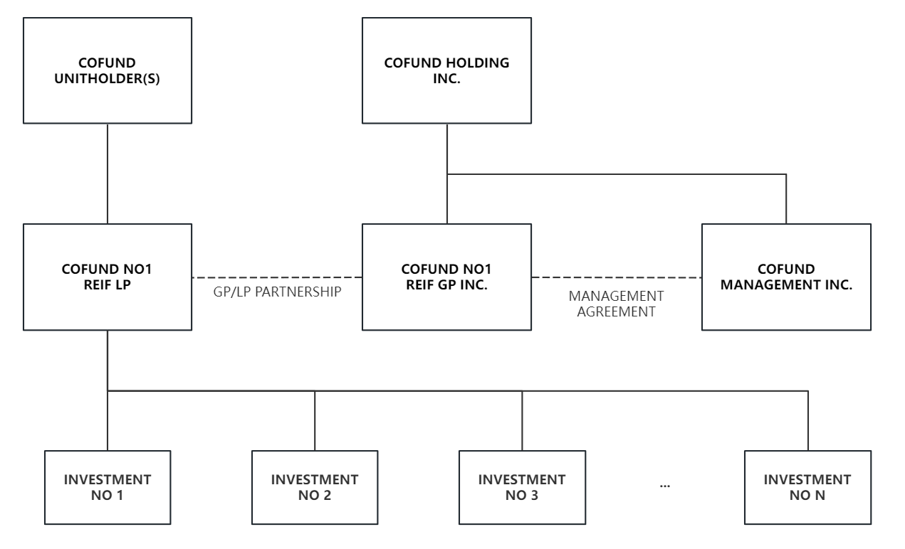

# CONFIDENTIAL INVESTMENT TERM SHEET

## Fund

Cofund Real Estate Investment Fund (the "REIF") is a private fund with a unique focus on a broad spectrum of real estate investments. These investments include mortgages, revenue generating properties, development projects, as well as securitized real estate products. Backed by a diverse portfolio of high-quality real estate assets, the Cofund REIF offers investment security while simultaneously delivering premium returns.

## Units Offered

Three classes of limited partnership units (the "Units") of the Fund will be created and offered for sale:

- CLASS A: for Accredited Investors
- CLASS I: for Institutional Investors
- CLASS P: for Partnership Investors

Each class has different profit distribution mechanisms. For more information, refer to the Section "GP Performance Incentive".

## Subscription  

- Price per Unit - $1,000.00 per Unit (the "Subscription Amount").
- Minimum Subscription - $150,000.00, or 150 Units.
- Maximum Placement - 30,000 Units ($30,000,000)
- Minimum Placement - 10,000 Units ($10,000,000)
- For CLASS P (Partnership Investors)  
  - 20% deposit is due on Term Sheet signed, starting from Sep 2023
  - 80% remaining balance is due on Jan 31, 2024
- For CLASS A/I (Accredited/Institutional Investors)  
  - 20% deposit is due on Term Sheet signed, starting from Sep 2023
  - 80% remaining balance is due on May 31, 2024

## REIF Structure

## General Partner

Cofund REIF is a limited partnership set to be established in Ontario. COFUND REIF NO1 GP INC., a corporation incorporated in Ontario, will serve as the "General Partner" of the REIF. A Fund Manager will be hired to oversee the day-to-day operations of the REIF.

## Fund Manager

An affiliated oranization, COFUND MANAGEMENT INC., to manage and provide services related to the investments in the portfolio.

## Fund Management Fee

The fund will pay the Fund Manager 2% of the Assets Under Management (AUM) per year, payable quarterly, for the day-to-day operation of the fund. If the actual operational cost of the fund exceeds the 2% of AUM, the Fund Manager is responsible for covering the difference.

## GP Performance Incentive

Different investment classes have distinct waterfall performance incentive mechanisms:  

| CLASS A (Accredited Investors) | |
| ----------- | ----------- |  
| Annualized ROI Buckets | GP Performance Incentive |
| 0% - 11% | 2% (for the portion below 11%)|
| Above 11% up to 20% | 35% (for the portion exceeding 11%)|
| Above 20% up to 25% | 65% (for the portion exceeding 20%)|
| 25% and above | 65%  (for the portion exceeding 25%)|

| CLASS I (Institutional Investors) | |
| ----------- | ----------- |  
| Annualized ROI Buckets | GP Performance Incentive |
| 0% - 11% | 1% (for the portion below 11%)|
| Above 11% up to 20% | 5% (for the portion exceeding 11%)|
| Above 20% up to 25% | 25% (for the portion exceeding 20%)|
| 25% and above | 50%  (for the portion exceeding 25%)|

| CLASS P (Partnership Investors) | |
| ----------- | ----------- |  
| Annualized ROI Buckets | GP Performance Incentive |
| 0-15% | 1% (for the portion below 15%)|
| Above 15% up to 20% | 3% (for the portion exceeding 15%)|
| 20% and above | 10%  (for the portion exceeding 20%)|

Since the GP/LP is a tax flow-through structure, the annualized ROI will be calculated based on earnings before taxes(EBT) in accordance with IFRS.

## Investment Period

The Fund will invest the proceeds from the Placement as stated under "Investment Objective." This will occur between the Closing and the earliest of the 3.5-year anniversary of the Closing, with a potential extension of one year.

## Investment Strategy

The Fund aims to build a diversified portfolio of real estate investments, with a focus on mortgage and equity investments in properties with development potential in Toronto and Ontario. Mortgage investments can generate stable cash flow with collateral protection, while equity investments in development projects offer aggressive gains.

- About 30-60% of the AUM will be in Mortgages Investments
- About 30-60% of the AUM will be in Equity Investments
- About 10-20% will be reserved as cash or cash equivalents
- The underlying real estate assets are diversified, encompassing sectors such as residential, industrial, retail, rental apartments, and more.

Investment strategies are subject to change in order to adapt to today's fast-paced market conditions, but will be announced at investor meetings if there are any changes.

## Distributions

The Fund intends to provide 6% annulized cash distributions to Unit holders once investments have been made and sufficient cash flows are available.

## Investors

Units will only be available to accredited investors and investors who meet certain exemptions under securities laws. Non-Residents of Canada will be excluded from investing in Units.

## Reporting

Holders of Units will receive annual reports, unaudited interim financial statements, and applicable tax forms.

## Transferability of Units

Units cannot be transferred without the consent of the General Partner, subject to certain conditions and compliance with securities laws.

## Committees

The General Partner will establish a Management Committee and an Independent Committee to oversee strategic decisions, investments, and related party matters.

## Formation Expenses

The Fund will cover formation expenses up to a certain amount, and the General Partner will be responsible for expenses exceeding this limit.

## Operating Expenses

The Fund will be responsible for all expenses related to its operations, including fees for services provided by the General Partner.
