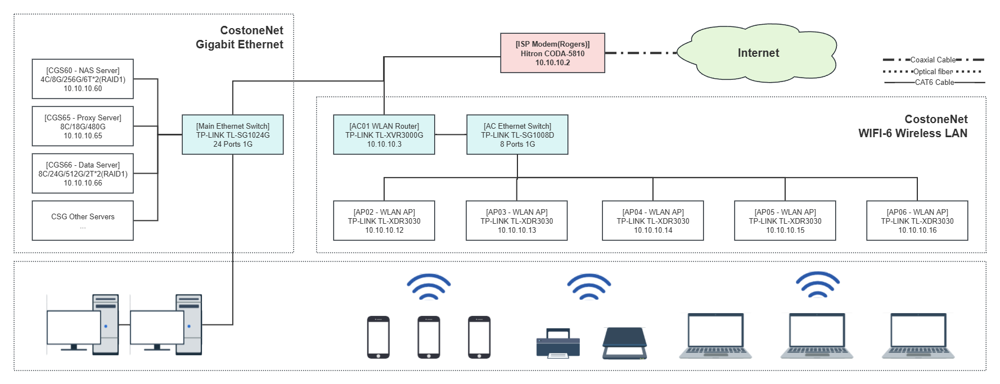

# CostoneNet

## Scheme
- General Info
    - Subnetting: 10.10.10.0/24
    - Default Gateway: 10.10.10.2
    - DNS Servers: 8.8.8.8, 8.8.4.4
    - DDNS: costone.duckdns.org
- Address Allocation
    - 10.10.10.0 ~ 10.10.10.19: Network Infrastructures
    - 10.10.10.20 ~ 10.10.10.49: Reserved IPs
    - 10.10.10.50 ~ 10.10.10.69: Local Servers(CGS)
    - 10.10.10.70 ~ 10.10.10.89: Workstations(CGW)
    - 10.10.10.90 ~ 10.10.10.254: DHCP Dynamic Allocation
- Static IPs
    - ISP Modem(Rogers): 10.10.10.2
    - AC01 - Primary WLAN Router: 10.10.10.3
    - AP02 - WLAN Access Point: 10.10.10.12
    - AP03 - WLAN Access Point: 10.10.10.13
    - AP04 - WLAN Access Point: 10.10.10.14
    - AP05 - WLAN Access Point: 10.10.10.15
    - AP06 - WLAN Access Point: 10.10.10.16
    - CGS60 - NAS Server: 10.10.10.60
    - CGS65 - Proxy Server: 10.10.10.65
    - CGS66 - Data Server: 10.10.10.66
    - CGW88 - Red Workstation: 10.10.10.88

## Network Topology

## Servers & Services
### [AC01 WLAN Router]
- TP-LINK TL-XVR3000G
- 4C:10:D5:C6:1C:1E
- 10.10.10.3

### [AP02 - WLAN AP]
- TP-LINK TL-XDR3030
- 4C:10:D5:C3:6A:CC
- 10.10.10.12

### [AP03 - WLAN AP]
- TP-LINK TL-XDR3030
- 4C:10:D5:C1:BF:EE
- 10.10.10.13

### [AP04 - WLAN AP]
- TP-LINK TL-XDR3030
- 4C:10:D5:B0:D0:43
- 10.10.10.14

### [AP05 - WLAN AP]
- TP-LINK TL-XDR3030
- 4C:10:D5:C3:66:48
- 10.10.10.15

### [AP06 - WLAN AP]
- TP-LINK TL-XDR3030
- 4C:10:D5:C3:66:40
- 10.10.10.16

### [CGS60 - NAS Server]
- ASROCK-J3455 4C/8G/256G/6T*2
- 70:85:C2:71:3F:3C
- 10.10.10.60
- 22 Secure Shell(SSH)
- 111/2049 NFS Service
- 139/445 SMB Service
- OneDrive Backup Sync

### [CGS65 - Proxy Server]
- DELL-T3500 8C/18G/480G
- bc:30:5b:d3:8d:c7
- 10.10.10.65
- 22 Secure Shell(SSH)
- 80/433 VHost & Reverse Proxy
- 500/4500 L2TP/IPSec VPN
- 9090 Cockpit Console

### [CGS66 - Data Server]
- DELL-T3500 8C/24G/512G/2T*2(RAID1)
- 00:26:b9:8d:26:2e
- 10.10.10.66
- 22 Secure Shell(SSH)
- 111/2049 NFS Service
- 139/445 SMB Service
- 3306 MySQL Database
- 6379 Redis Database
- 9090 Cockpit Console