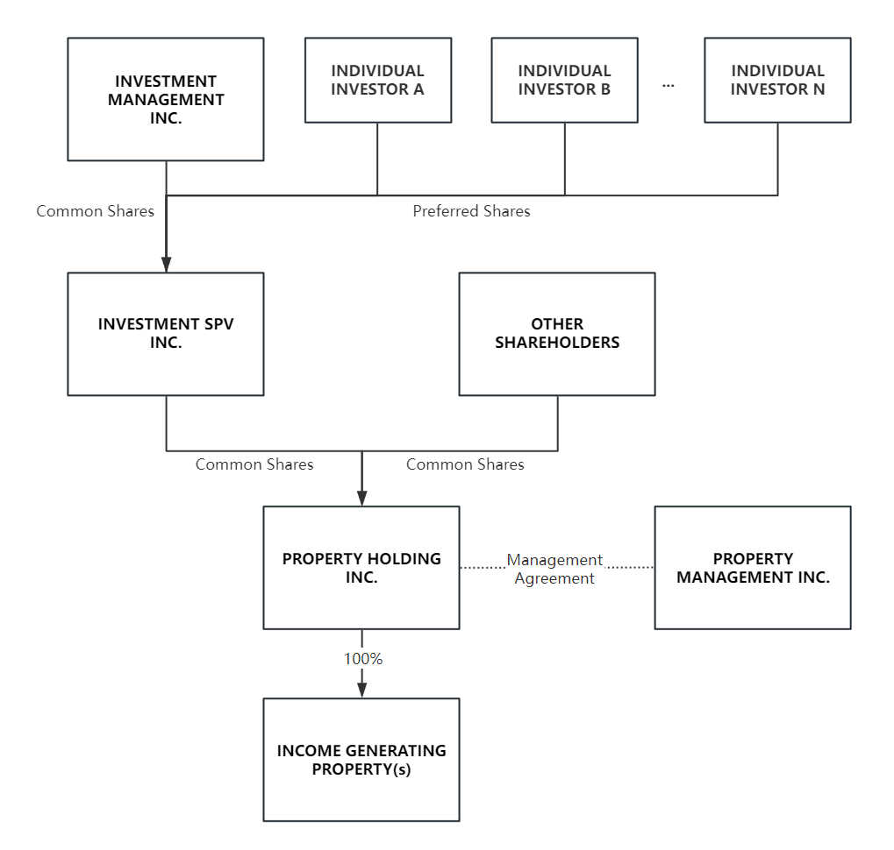

# REAL ESTATE INVESTMENT SPV

This Investment SPV (Special Purpose Vehicle) is designed to enable individual investors with limited investment capacity to own and benefit from one or more income-generating properties or development projects on track to become such assets. These properties may include multi-residential buildings, condo industrial warehouses, commercial plazas, and more.

This document serves as a guideline for legal experts to establish such a structure. The contents enclosed within [square brackets] are placeholders where NAMES, DATES, and NUMBERS should be inserted according to specific requirements.

It's important to note that implementing such a structure using corporate entities (or companies) is not considered tax-efficient within Ontario's jurisdiction. Replacing all instances of "INC." with a GP/LP partnership or a Trust could establish a tax flow-through structure. This change may offer improved tax efficiency but might also lead to higher implementation costs and increased complexity.

## SPV Structure

Figure 1: The Structure Diagram of the SPV

### [INCOME GENERATING PROPERTY]

The term [INCOME GENERATING PROPERTY] refers to an existing property capable of generating cash flow or to a property with a development plan aimed at becoming income-generating. This includes, but is not limited to, multi-residential buildings, industrial condominiums(condo warehouse), commercial plazas, and other similar properties. A specific example of an income-generating property is outlined as follows:

The [PROPERTY/PROJECT NAME], located at [PROPERTY ADDRESS], features [PROPERTY DESCRIPTION]. The current status of the property is [CURRENT STATUS]. The development plan(if applicable) is [DEVELOPMENT PLAN].

### [PROPERTY HOLDING INC.]

The term [PROPERTY HOLDING INC.] refers to an entity with the sole purpose of filling the following responsibilities:

- A. Holding the title to [INCOME GENERATING PROPERTY].

- B. Contracting [PROPERTY MANAGEMENT INC.] to manage the day-to-day operations of [INCOME GENERATING PROPERTY].

- C. Distributing income to shareholders.

This entity operates under the following restrictions:

- A. Retained Earnings are capped at a maximum of [n%] of the annual net income, ensuring the majority of the net income is distributed as dividends to shareholders.

- B. Beyond the management fee paid to the [PROPERTY MANAGEMENT INC.], internal operational costs are not to exceed [n%] of the annual gross income, reflecting its limited scope of responsibilities.

### [PROPERTY MANAGEMENT INC.]

[PROPERTY MANAGEMENT INC.] is contracted by [PROPERTY HOLDING INC.] to manage the [INCOME GENERATING PROPERTY]. 

Typical responsibilities include, but are not limited to, tenant management, rent collection, ensuring compliance with laws and regulations, maintenance, and marketing. Detailed responsibilities and compensation should be defined in the [Management Agreement].

### [OTHER SHAREHOLDERS]

[OTHER SHAREHOLDER(S)] are common shareholders of [PROPERTY HOLDING INC.], alongside [INVESTMENT SPV INC.]. Together, they own 100% of the common shares of [PROPERTY HOLDING INC.], representing their total equity interests in the [INCOME GENERATING PROPERTY].

### [INVESTMENT SPV INC.]

[INVESTMENT SPV INC.] is established as the entity within which diverse return plans can be executed to meet the varied objectives of different investor groups. Functioning as a special purpose vehicle, [INVESTMENT SPV INC.] is dedicated solely to performing specified investment services. Accordingly, there is no provision for retained earnings; all net income must be completely distributed to its shareholders in alignment with the stipulated investment terms.

## Document Preparation Checklist

### 1. Articles of Incorporation for [PROPERTY HOLDING INC.]

- The entity should be registered if it does not already exist.

### 2. Proof of the Ownership for [INCOME GENERATING PROPERTY]

- To prove that [INCOME GENERATING PROPERTY] is an asset owned by [PROPERTY HOLDING INC.], such documentation might include a Parcel Register from Ontario's land registration system, demonstrating clear title and ownership.

### 3. Shareholder Agreement of [PROPERTY HOLDING INC.] 

- [PROPERTY HOLDING INC.] shall issue a single class of common shares, totaling [n] shares. It is recommended that the quantity of common shares issued reflects the characteristics of the [INCOME GENERATING PROPERTY]. For instance, if the Bennett Residence located at 15 Glen Morris Street comprises 41 similar rental units, it is suggested that a total of 41,000 shares be issued.

- Beyond the standard shareholder agreement among the common shareholders of [PROPERTY HOLDING INC.], which delineates their respective rights, responsibilities, and obligations, the agreement should incorporate the following key terms:

    - [PROPERTY HOLDING INC.] is obligated to hold the title to [INCOME GENERATING PROPERTY].

    - [PROPERTY HOLDING INC.] is obligated to contract a [PROPERTY MANAGEMENT INC.] to manage the day-to-day operations of [INCOME GENERATING PROPERTY].

    - [PROPERTY HOLDING INC.] is obligated to distribute income to shareholders.

    - [PROPERTY HOLDING INC.] is obligated to cap the Retained Earning at a maximum of [n%] of the annual net income.

    - [PROPERTY HOLDING INC.] is obligated to cap the Internal Operational Cost at a maximum of [n%] of the annual gross income.

    - [PROPERTY HOLDING INC.] is obligated to cap the Loan to Value (LTV) ratio to a maximum of [n%] of the total asset value.

    - A Special Resolution, requiring the approval of [n%] of shareholders before execution, is necessary for the following actions:

        - The acquisition of new assets.

        - The liquidation of existing assets.

        - Revisions or amendments to the current Shareholder Agreement.

### 4. Share Transfer Agreement of [PROPERTY HOLDING INC.]

- This agreement shall be a standard share transfer agreement, permitting the founder of [PROPERTY HOLDING INC.] to distribute the common shares of [PROPERTY HOLDING INC.] to specified entities at variable prices. All new shareholders are required to consent to the Shareholder Agreement of [PROPERTY HOLDING INC.] as a condition of their share acquisition.

### 5. Share Option Contract of [PROPERTY HOLDING INC.]

- Given the uncertainties inherent in fundraising efforts, there is no guarantee regarding the amount of funds [INVESTMENT SPV INC.] can raise within a predetermined timeframe. Consequently, an American-style share option shall be issued to each SPV, granting them the right to purchase up to [n] shares of common share from [PROPERTY HOLDING INC.] at a strike price of [n] dollars per share before the [Expiry Date]. 

- Upon reaching the [Expiry Date], each SPV is obligated to exercise the option in accordance with the total funds raised. Subsequently, the formal Share Transfer Agreement of [PROPERTY HOLDING INC.] will be formalized and executed.

### 6. Article of Incorporation for [PROPERTY MANAGEMENT INC.]

- The entity should be registered if it does not already exist.

### 7. Property [Management Agreement] 

- This agreement will constitute a standard property management contract between [PROPERTY HOLDING INC.] and [PROPERTY MANAGEMENT INC.], wherein responsibilities and compensations are precisely defined. A special provision to be included is that the shareholders of [PROPERTY HOLDING INC.] shall have priority in renting properties at market rates.

- The agreement shall be structured predominantly in favor of [PROPERTY MANAGEMENT INC.] by offering flexibility, considering that [PROPERTY HOLDING INC.] is subject to a strict Shareholder Agreement regarding Operational Costs and Retained Earnings.

### 8. Article of Incorporation for [INVESTMENT SPV INC.]

- The entity should be registered if it does not already exist.

### 9. Shareholder Agreement of [INVESTMENT SPV INC.]

All terms and conditions related to investment returns shall be expressly defined within this Special Purpose Vehicle (SPV), acting as an isolation layer. Should any disputes arise from individual investors, such disputes shall be resolved within the confines of the SPV, ensuring that the property ownership layer remains unaffected.

The agreement should incorporate the following key terms:

- Class of Shares - Three classes of shares shall be issued.

    - Class A - Common Share

        - Endowed with full voting rights and designated for [INVESTMENT MANAGEMENT INC.], the Class A common share assigns the shareholder the responsibility of providing specified investor services to holders of Preferred Shares. This includes issuing cash distributions and providing reports and tax forms. Costs associated with these services are reimbursable but must not exceed [2%] of the total revenue. In the event of cost overruns, the management company is required to cover any shortfall.

    - Class B - Preferred Share (Fixed Return)

        - With no voting rights, Class B preferred shares are designated for investors seeking a fixed investment return. Investors holding Class B preferred shares will receive a fixed [n%] return on cash distributions, non-compounding annually, and disbursed [quarterly].

        - In the event that the underlying [INCOME GENERATING PROPERTY] underperforms and does not generate sufficient net income to cover the fixed return for Class B preferred share investors, it is the responsibility of [INVESTMENT MANAGEMENT INC.] to cover the shortfall. Conversely, should the [INCOME GENERATING PROPERTY] overperform, resulting in excess net income beyond the fixed return for Class B preferred share investors, [INVESTMENT MANAGEMENT INC.] is entitled to retain the surplus.

    - Class C - Preferred Share (Variable Return)

        - With no voting rights, Class C preferred shares are designated for investors seeking for a variable investment return. Investors with Class C preferred shares are entitled to a variable return on cash distributions, reflective of the performance and net income of the underlying [INCOME GENERATING PROPERTY].

-  Issuance of Shares - The total number of shares issued, encompassing all classes, should correspond to the quantity of common shares that [INVESTMENT SPV INC.] owns in [PROPERTY HOLDING INC.]. For example, if [INVESTMENT SPV INC.] owns 20,000 out of 41,000 common shares in [PROPERTY HOLDING INC.], then [INVESTMENT SPV INC.] should issue a total of 20,000 shares across all classes. Preferred Shares may be issued at varying prices, contingent upon the timing and scale of investment; however, the rights attributed to each share class shall remain consistent.

- Order of Priority - In the event of liquidation, the liquidation preference ensures that investors with Class B and Class C (Preferred Share) see their investment principal prioritized over [INVESTMENT MANAGEMENT INC.], which possesses Class A (Common Share). In the scenario where assets remain post the settlement of all investment principal, the residual profits will be allocated among all three classes in accordance with their respective share percentages.

- Share Transfer - Investors in possession of Class B and Class C preferred shares are prohibited from transferring their shares without the express consent of [INVESTMENT MANAGEMENT INC.]. Correspondingly, [INVESTMENT MANAGEMENT INC.] holds the primary right of purchase at the same rate. Should [INVESTMENT MANAGEMENT INC.] decline this option, other existing preferred shareholders are granted secondary priority to purchase the shares. If neither party opts to acquire them, the preferred shares may then be offered for sale on the open market.

### 10. Investment Agreement of [INVESTMENT SPV INC.]

- WIP

### 11. Article of Incorporation for [INVESTMENT MANAGEMENT INC.]

- The entity should be registered if it does not already exist.